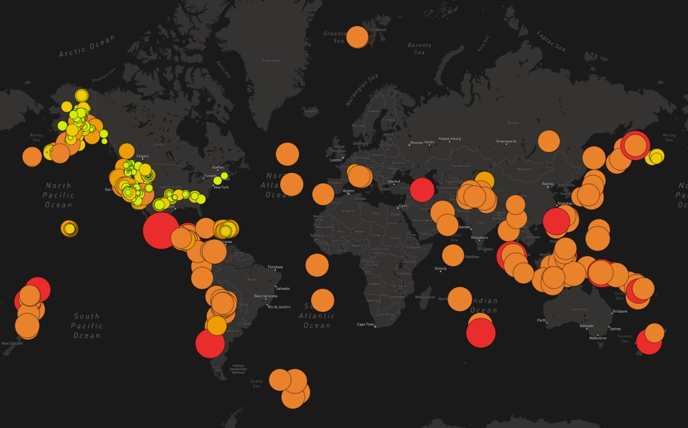

# Mapping_Earthquakes
 
 ## Creating interactive maps using Leaflet.js, GeoJSON data, Javascript, the D3.js library and APIs to explore earthquakes around the world.
 
 
 
### Project Overview

Earthquakes are caused by sudden slips on fault planes. Tectonic plates are always slowly moving, but they become stuck at their edges due to friction. When the stress on the edges overcomes the friction, there is an earthquake that releases the energy in seismic waves that travel through the earth’s crust and cause the ground surface to shake. 

In this project, the latest earthquake GeoJSON data from the US Geological Survey website is utilized to create an interactive visualization for the user to observe the locations and magnitudes of earthquakes reported around the world within the last seven days. 

### Resources

#### Data

* GeoJSON data from: https://earthquake.usgs.gov/data/data.php#eq
* majorAirports.json
* torontoNeighborhoods.json
* torontoRoutes.json

#### Software

* Javascript
* D3.js 
* VisualStudio 1.71.2
* Leaflet: an open-source JavaScript library for mobile-friendly interactive maps
* Mapbox: a company that provides custom maps for websites and applications that supplies the API
* HTML and CSS to render and style the webpage

### Results

The map can be viewed in three different layer templates: street view, satellite view and dark view. Earthquakes, major earthquakes and fault lines can be selected and deselected to customize the user’s visualization. The map can be zoomed in and out upon and moved to suit the user’s needs and pop-up markers are displayed when one of the color-coded markers is selected. Not only are the markers color coded depending on their magnitudes, but they are also coded by size as well. This data allows the user to observe the relationships between seismic activity and tectonic plates.

Below is a zoomed in snapshot of the state of California and it's earthquakes, color and size coded by magnitude with a visible pop-up marker:

  
 
The screenshots below depict the map key and overlay controls on the interactive map:

   

URLs are used to obtain the GeoJSON earthquake data, geographical coordinates, tectonic plate boundaries and magnitudes from the US Geological Survey website. Javascript and D3.js is used to retrieve the coordinates and magnitudes from the GeoJSON data and the Leaflet library is used to plot the data retrieved and add multiple layers onto a Mapbox map through an API call. This creates the interactive functionality of the map. 

The interactive map is viewable on the webpage below:
https://jeaninemjordan.github.io/mapearthquakesdeploy.io/

Below is a screenshot of the street layer view of the map, depicting the tecnonic plates, earthquakes and major earthquakes: 

 

Below is a screenshot of the dark view layer of the map, only depicting earthquakes and major earthquakes:

 

Below is a screenshot of the satelite view layer of the map, only depicting the fault lines:

 

 Below is a screenshot plotting the earthquakes within the last seven days onto the map:
 
 
 Below is a screenshot plotting a single point on the map:
 
 
 Below is a screenshot plotting a multiple points on the map:
 
 
 Below are screenshots plotting multiple points onto the map that displays the major airports near faultlines: 
   
 
Below is a screenshot plotting lines on a map of the United States:
 
 
Below is a screenshot plotting the neighborhoods of Toronto, CA on the map:
 
 
Below is a screenshot plotting linestrings on the map:
  
 

